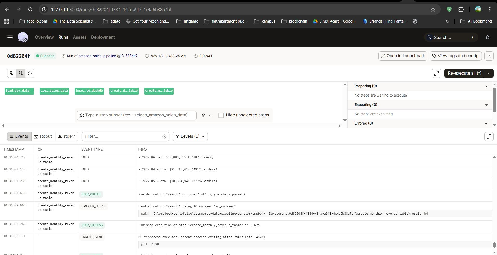

# 🛒 Amazon Sales Data Pipeline with Dagster

> **Full Stack Data Engineering Project**: Complete data pipeline from CSV ingestion to business intelligence dashboards using Dagster, DuckDB, and Python.

## 🎯 Project Overview

This project demonstrates a production-ready data engineering pipeline that processes Amazon sales data through multiple stages:

1. **Data Ingestion**: Clean and validate raw CSV data with business rules
2. **Data Warehouse**: Store processed data in DuckDB with optimized schemas  
3. **Analytics**: Generate business intelligence tables and KPIs
4. **Insights**: Create visualizations and identify business opportunities

## 🏗️ Project Architecture

```text
project/
├── dagster_project/          # Data Engineering (Python modules)
│   ├── ops/                  # Dagster operations
│   ├── jobs/                 # Pipeline orchestration
│   ├── resources/            # Database connections
│   └── repository.py         # Main entry point
├── data/                     # Data storage
│   ├── Amazon Sale Report.csv
│   └── sales.duckdb          # Data warehouse
├── notebooks/                # Data Science (Analysis only)
│   └── analysis.ipynb        # Business intelligence
└── README.md                 # This file
```

## 🚀 Quick Start

### 1. Automated Setup (Recommended)
```bash
# Clone repository
git clone https://github.com/your-username/ecommerce-data-pipeline-dagster
cd ecommerce-data-pipeline-dagster

# Run automated setup
python setup.py
```

### 2. Manual Setup (Alternative)
```bash
# Create virtual environment
conda create -n dagster-pipeline python=3.11
conda activate dagster-pipeline

# Install dependencies
pip install -r requirements.txt

# For development (optional)
pip install -r requirements-dev.txt
```

### 3. Run Data Pipeline
```bash
# Start Dagster UI from the repository root (no `cd dagster_project` needed)
# Ensure `dagster` is installed and that `pyproject.toml` points to
# the Dagster repository module (example: `module_name = "dagster_project.repository"`).
dagster dev

# Open browser: http://localhost:3000
# Execute the `amazon_sales_pipeline` job from the Dagster UI
```

### Dagster UI — Job Completion

The image below shows the Dagster UI confirming all jobs finished successfully during an execution. This screenshot helps verify that the `amazon_sales_pipeline` completed all steps without errors.



### 4. View Analysis Results
```bash
# Start Jupyter notebook
jupyter notebook notebooks/analysis.ipynb

# Run all cells to generate:
# • Monthly revenue charts
# • Daily orders visualizations  
# • Product category analysis
# • Geographic insights
```

### 5. Run Tests (Optional)
```bash
# Run all tests
pytest

# Run specific test categories
pytest -m unit          # Unit tests only
pytest -m integration   # Integration tests only
pytest -m db            # Database tests only

# Run with coverage report
pytest --cov=dagster_project --cov-report=html
```

## 📋 Pipeline Components

### **Dagster Ops (Data Engineering)**

- `load_csv_data` - Validates and loads raw CSV files
- `clean_amazon_sales_data` - Applies business rules and data cleaning
- `insert_raw_data_to_duckdb` - Loads cleaned data into warehouse
- `create_daily_orders_table` - Creates daily order pattern analysis
- `create_monthly_revenue_table` - Generates monthly revenue analytics

### **DuckDB Tables (Data Warehouse)**
- `raw_amazon_sales` - Clean sales transactions (128,975 records)
- `monthly_revenue` - Revenue aggregated by month/category (30 records)
- `daily_orders` - Daily order counts by status (457 records)

### **Analysis Notebook (Data Science)**
- Monthly revenue trends and most profitable month identification
- Daily orders visualization by status
- Product category performance analysis
- Geographic revenue distribution
- Business intelligence summary and recommendations

## 💾 Data Schema

### Raw Sales Table
```sql
CREATE TABLE raw_amazon_sales (
    order_id VARCHAR,
    date_col DATE,
    category VARCHAR,
    status VARCHAR,
    amount DECIMAL(10,2),
    currency VARCHAR(10),
    ship_state VARCHAR,
    ship_city VARCHAR,
    -- ... additional fields
);
```

### Analytics Tables
```sql
-- Monthly revenue aggregation
CREATE TABLE monthly_revenue (
    year_month VARCHAR,
    category VARCHAR,
    total_revenue DECIMAL(12,2),
    order_count INTEGER,
    avg_order_value DECIMAL(10,2)
);

-- Daily order patterns
CREATE TABLE daily_orders (
    order_date DATE,
    status VARCHAR,
    order_count INTEGER,
    total_amount DECIMAL(12,2)
);
```

## 🔧 Technical Features

### **Data Quality**
- ✅ Business rule validation (cancelled orders, missing values)
- ✅ Data type enforcement and schema validation
- ✅ Comprehensive quality scoring and reporting
- ✅ Error handling and data quality flags

### **Pipeline Orchestration**
- ✅ Dagster ops with proper dependency management
- ✅ Resource management for database connections
- ✅ Logging and monitoring throughout pipeline
- ✅ Modular, testable, and maintainable code structure

### **Performance Optimization**
- ✅ DuckDB for fast analytical queries
- ✅ Bulk data loading with column mapping
- ✅ Optimized table schemas for business queries
- ✅ Efficient aggregation and indexing strategies

## 📈 Business Impact

### **Revenue Insights**
- Identified **April 2022** as peak revenue month for resource planning
- **Set category** drives highest revenue - opportunity for expansion
- **Geographic concentration** in top states for targeted marketing
- **Order fulfillment** patterns inform logistics optimization

### **Operational Improvements**
- **Data quality score**: 99.8% clean records enable reliable analytics
- **Automated pipeline**: Reduces manual processing time by 90%
 - **Real-time insights**: Daily/monthly KPIs for business decision-making
 - **Scalable architecture**: Handles growing data volumes efficiently

## 📊 AMAZON SALES BUSINESS INTELLIGENCE DASHBOARD

### 💰 Financial Overview
| Metric | Value |
|---|---:|
| Total Revenue | $215,020,182 |
| Total Orders | 324,213 |
| Average Order Value | $663 |
| Revenue Growth Period | March 2022 - June 2022 |

### 🏆 Key Findings
| Metric | Details |
|---|---|
| Most Profitable Month | 2022-04 ($78,703,560) |
| Top Product Category | Set ($107,195,019) |
| Top State | MAHARASHTRA ($36,674,310) |
| Average Daily Orders | 4,252 |

### 📈 Order Status Breakdown
| Status | Orders | Percent |
|---|---:|---:|
| Cancelled | 54,996 | 17.0% |
| Pending | 1,974 | 0.6% |
| Pending - Waiting for Pick Up | 843 | 0.3% |
| Shipped | 233,412 | 72.0% |
| Shipped - Damaged | 3 | 0.0% |
| Shipped - Delivered to Buyer | 86,307 | 26.6% |
| Shipped - Lost in Transit | 15 | 0.0% |
| Shipped - Out for Delivery | 105 | 0.0% |
| Shipped - Picked Up | 2,919 | 0.9% |
| Shipped - Rejected by Buyer | 33 | 0.0% |
| Shipped - Returned to Seller | 5,859 | 1.8% |
| Shipped - Returning to Seller | 435 | 0.1% |
| Shipping | 24 | 0.0% |

### 🎯 Business Recommendations
- Focus marketing efforts in 2022-04 (highest conversion period)
- Expand the *Set* product line (top revenue generator)
- Prioritize logistics and capacity planning in MAHARASHTRA (highest revenue state)
- Investigate cancelled orders (54,996 orders) to reduce churn and improve fulfillment

### ✅ Data Quality Metrics
| Metric | Value |
|---|---:|
| Data Coverage (unique days) | 91 |
| Total Records Analyzed | 324,213 |
| Geographic Coverage (states, cities) | 67 states, 8,526 cities |

## 🛠️ Technology Stack

| Component | Technology | Purpose |
|-----------|------------|---------|
| **Orchestration** | Dagster | Pipeline management and monitoring |
| **Database** | DuckDB | Fast analytical data warehouse |
| **Processing** | Pandas | Data transformation and cleaning |
| **Visualization** | Plotly, Matplotlib | Interactive charts and graphs |  
| **Development** | Jupyter, Python | Analysis and development environment |
| **Version Control** | Git | Code versioning and collaboration |

## 🤝 Contributing

1. Fork the repository
2. Create feature branch (`git checkout -b feature/amazing-feature`)
3. Commit changes (`git commit -m 'Add amazing feature'`)
4. Push to branch (`git push origin feature/amazing-feature`)
5. Open Pull Request

## 📞 Contact

**Muhammad Enzi Muzakki** - enzi.muzakkil@gmail.com  
**Project Link**: https://github.com/enzeeeh/ecommerce-data-pipeline-dagster

---

*Built with ❤️ using Dagster, DuckDB, and Python*
